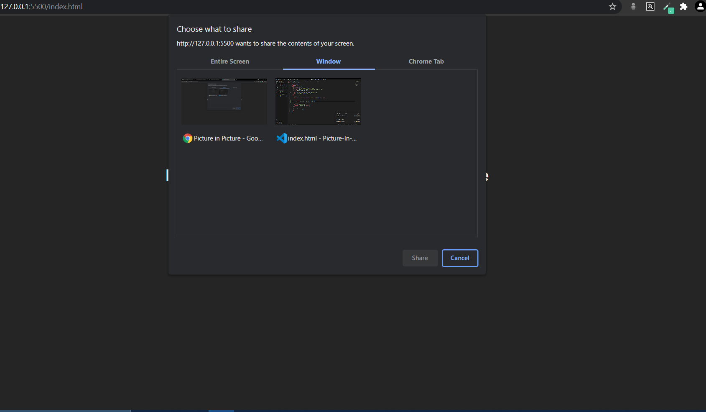

# Picture In Picture
The Picture in Picture is a simple Website with a button that triggers picture in picture mode when clicked. 
This Website uses the Screen capture Api to capture part or all of a screen from a window or a Chrome Tab. 
Capturing screen contents as a live MediaStream is initiated by calling " *navigator.mediaDevices.getDisplayMedia()* ", which returns a promise that resolves to a stream containing the live screen contents.
### Example of a Window allowing the user to select a display surface to capture :-

&nbsp

&nbsp

The picture in picture mode is enabled by calling the " *requestPictureInPicture()* " on the video element when the button is clicked. This method returns a promise that places the video in a mini window on the bottom-right side of the screen by default when resolved, although it can be moved around by the user.